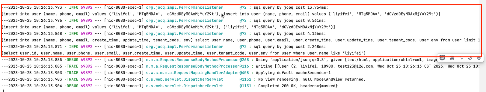
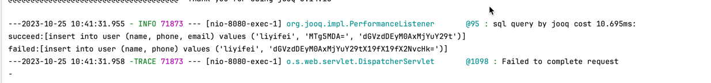
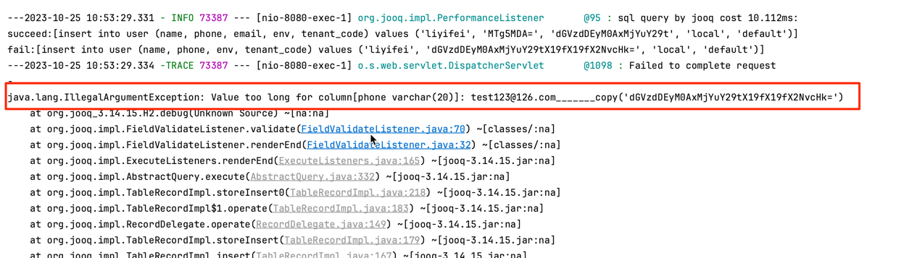
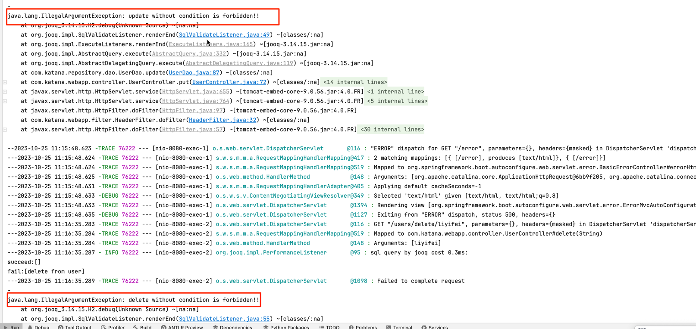
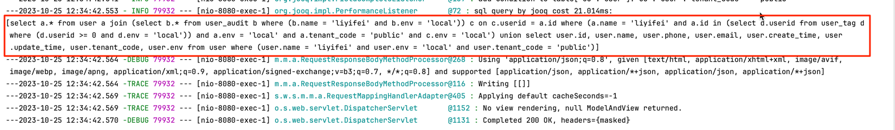
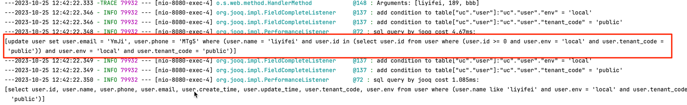
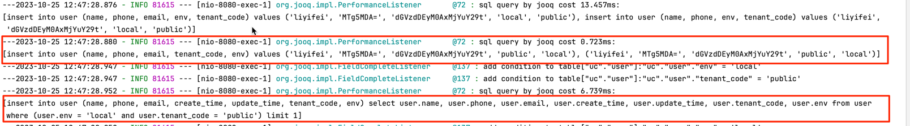

# Katana-JOOQ——为JOOQ框架提供增强

Katana-JOOQ是在JOOQ框架基础之上进行封装，为应用层提供一些非侵入式的高级特性，提升研发效率。

## Features

* 对SQL进行性能监控，如执行超时时进行SQL渲染打印和报警等，支持批量SQL监控
* 对SQL语句进行安全性校验，如是否包含Where条件，字段是否超长，避免服务端执行错误
* 动态修改SQL，针如多租户、环境隔离等特殊场景，提供非侵入式的解决方案，提高安全性和可靠性
* 针对SQL查询条件，支持链式校验，提升研发效率和流畅性

## Quick start

### Maven依赖

```xml

<dependency>
    <groupId>io.github.nianien</groupId>
    <artifactId>katana-jooq</artifactId>
    <version>...</version>
</dependency>  
```

### Java用例

#### 1. 耗时监控

**配置监听器**

```Java
 DefaultConfiguration config=new DefaultConfiguration();
        config.setSQLDialect(sqlDialect);
        config.setDataSource(dataSource);
        config.settings()
        .withRenderSchema(false)
        .withRenderNameCase(RenderNameCase.AS_IS)
        .withRenderQuotedNames(RenderQuotedNames.EXPLICIT_DEFAULT_UNQUOTED);
        config.set(
        new PerformanceListener().asExecuteListener());
        return DSL.using(config);
```

**代码示例**

```Java
//batch insert
UserRecord[]records=new UserRecord[count];
        for(int i=0;i<count; i++){
        UserRecord record=new UserRecord();
        record.setName(name);
        record.setPhone(phone);
        record.setEmail(email);
        records[i]=record;
        }
        dslContext.batchInsert(records).execute();

//insert mutil rows
        UserRecord record=new UserRecord();
        record.setName(name);
        record.setPhone(phone);
        record.setEmail(email);
        dslContext.insertInto(USER).set(record).newRecord().set(record).execute();

//insert...select
        Field[]fields=new Field[]{USER.NAME,USER.PHONE,USER.EMAIL,USER.CREATE_TIME,USER.UPDATE_TIME,USER.TENANT_CODE,USER.ENV};
        dslContext.insertInto(USER,fields)
        .select(dslContext.select(fields).from(USER).limit(1))
        .execute();
```

**执行结果**

下图显示了渲染后的SQL语句执行耗时：


注意：

***1、*** 批量SQL执行是统计整体耗时，并以数组的形式显示每条执行SQL。如果其中有执行失败的SQL，则会分别显示成功的SQL和失败的SQL:

```java
UserRecord[]records=new UserRecord[count];
        for(int i=0;i<count; i++){
        UserRecord record=new UserRecord();
        record.setName(name);
        record.setPhone(phone);
        if(i%2==0){
        record.setEmail(email);
        }else{
        record.setPhone(email+"_______copy");
        }
        records[i]=record;
        }
        dslContext.batchInsert(records).execute();

        UserRecord record=new UserRecord();
        record.setName(name);
        record.setPhone(phone);
        record.setEmail(email);
        dslContext.insertInto(USER).set(record).newRecord().set(record).execute();
```
***2、*** SQLDialect对于quote的定义在Identifiers#QUOTES中，可以根据实际情况进行修改，以适应不同的数据库方言：

```java
final class Identifiers {

    static final EnumMap<SQLDialect, char[][][]> QUOTES;

```
***3、*** 如果SQL超长，可以启动缩略打印；如果参数列表过长，同样支持截断
```text
select * from user where id  in (1001,1001, 1002,...) and auditor in(select name from user_audit where name in('a','b','c',...))
```



#### 2. SQL校验

**添加监听器**

```Java
 DefaultConfiguration config=new DefaultConfiguration();
        config.setSQLDialect(sqlDialect);
        config.setDataSource(dataSource);
        config.settings()
        .withRenderSchema(false)
        .withRenderNameCase(RenderNameCase.AS_IS)
        .withRenderQuotedNames(RenderQuotedNames.EXPLICIT_DEFAULT_UNQUOTED);
        config.set(new FieldValidateListener().asExecuteListener()
        );
        return DSL.using(config);
```

**代码示例**

（1）校验字段长度

```Java
UserRecord record=new UserRecord();
        record.setName(name);
        record.setPhone(phone);
        record.setEmail(email); //length exceed limit
        dslContext.insertInto(USER).set(record).newRecord().set(record).execute();
```

**执行结果**


上图可以看到，异常是在客户端抛出的，说明字段校验发生在SQL执行前，避免了无效SQL发送到数据库服务端执行失败。

（2）校验update/delete语句是否包Where条件

```Java
//update without condition
dslContext.update(USER)
        .set(USER.EMAIL,email)
        .set(USER.PHONE,phone)
//delete without condition
        dslContext.delete(USER)
```

**执行结果**



#### 3.动态SQL

**添加监听器**

下面配置租户和环境隔离自动

```Java
// FieldCompleteListener.setFieldValue("tenant_code", tenantCode);
// FieldCompleteListener.setFieldValue("env", env); 
DefaultConfiguration config=new DefaultConfiguration();
        config.setSQLDialect(sqlDialect);
        config.setDataSource(dataSource);
        config.settings()
        .withRenderSchema(false)
        .withRenderNameCase(RenderNameCase.AS_IS)
        .withRenderQuotedNames(RenderQuotedNames.EXPLICIT_DEFAULT_UNQUOTED);
        config.set(new FieldCompleteListener().asExecuteListener());
        config.set(new FieldCompleteListener(new String[]{"tenant_code","public"},new String[]{"env","local"}).asVisitListener());
        return DSL.using(config);
```

**代码示例**

```Java
    com.katana.demo.entity.uc.tables.User ta=USER.as("a");
        com.katana.demo.entity.uc.tables.UserAudit tb=USER_AUDIT.as("b");
        com.katana.demo.entity.uc.tables.UserTag td=USER_TAG.as("d");
        // join subquery and where subquery
        dslContext.select(ta.asterisk()).from(ta)
        .join(
        dslContext.select(tb.asterisk()).from(tb)
        .where(tb.NAME.eq(name)
        ).asTable("c")
        )
        .on(tb.as("c").USERID.eq(ta.ID))
        .where(ta.NAME.eq(name))
        .and(ta.ID.in(dslContext.select(td.USERID).from(td).where(td.USERID.ge(0L))))
        .union(dslContext.select().from(USER)
        .where(USER.NAME.eq(name)))
        .fetchInto(User.class);
```

**执行结果**



由打印日志可以看出，在执行查询的时候，会自动根据上下文添加了tenant_code和env的字段匹配，实现了系统隔离，保证数据安全。

**代码示例**

```Java
dslContext.update(USER)
        .set(USER.EMAIL,email)
        .set(USER.PHONE,phone)
        .set(USER.TENANT_CODE,"tenant")
        .where(USER.NAME.eq(name))
        .and(USER.ID.in(dslContext.select(USER.ID).from(USER).where(USER.ID.ge(0L))))
        .execute()
```

**执行结果**



由打印日志可以看出，在执行更新的时候，会自动过滤tenant_code，避免人为操作导致的数据污染，保证数据安全。

**代码示例**

```Java
//try insert tenatcode "test"
UserRecord record=new UserRecord();
        record.setName(name);
        record.setPhone(phone);
        record.setEmail(email);
        record.setTenantCode("test");
//try insert tenatcode "test2"
        UserRecord record2=new UserRecord();
        record2.setName(name);
        record2.setPhone(phone);
        record2.setEmail(email);
        record2.setTenantCode("test2");

//try copy from other tenants
        dslContext.insertInto(USER).set(record).newRecord().set(record2).execute();
        Field[]fields=new Field[]{USER.NAME,USER.PHONE,USER.EMAIL,USER.CREATE_TIME,USER.UPDATE_TIME,USER.TENANT_CODE,USER.ENV};
        dslContext.insertInto(USER,fields).select(
        dslContext.select(fields)
        .from(USER).limit(1)).execute()
```

**执行结果**



由打印日志可以看出，在执行插入的时候，对于tenant_code字段，系统会将手动设置值替换为上下文中获取的字段值。另外在通过insert...select进行复制数据的时，也会对子查询增加过滤条件，保证只能复制当前租户的数据。

#### 4. SQL条件链式校验

```java
//long type = 100;
//String name = "jack";
//List<Integer> types = Arrays.asList(1001, 1002, 1003, 1004, 0, -1); 
Condition condition=FluentCondition.and()
        .when(gt0(type),UserTable.Type)
        .when(notEmpty(name),UserTable.NAME::ne)
        .when(notEmpty(types)
        .then(e->e.stream()
        .filter(i->i>0).toList())
        .when(List::isEmpty)
        .negate(),UserTable.TYPE::notIn)
        .get();
        System.out.println(dslContext.renderInlined(condition));
```

**执行结果**

```text
(id = 100 and name <> 'jack' and type not in (1001, 1002, 1003, 1004))
```

#### 5. SQL条件生成

```java

@Data
public class GoodsQuery {

    /**
     * 数据id
     */
    private Long id;
    /**
     * 业务标识
     */
    private Integer bizType;
    /**
     * 操作人
     */
    private String modifier;
    /**
     * 环境标识
     */
    @Match(Operator.NONE)
    private String env;
    /**
     * 任务单号
     */
    private String orderCode;
    /**
     * 运单号
     */
    private String mailNo;
    /**
     * 订单号
     */
    private String orderId;
    /**
     * 提报时间开始
     */
    @Match(name = "out_submit_time", value = Operator.GE)
    private Date submitTimeBegin;
    /**
     * 提报时间结束
     */
    @Match(name = "out_submit_time", value = Operator.LE)
    private Date submitTimeEnd;
    /**
     * 行业id
     */
    private Long industryId;
    /**
     * 行业名称
     */
    private String industryName;

    /**
     * 发货仓code
     */
    private String srcStoreCode;
    /**
     * 发货仓name
     */
    private String srcStoreName;
    /**
     * 价格
     */
    private BigDecimal price;
    /**
     * 过期时间
     */
    @Match(Operator.BETWEEN)
    private Date[] expireDate;
    /**
     * 创建时间
     */
    @Match(Operator.BETWEEN)
    private Date createDate;

}

    GoodsQuery query = new GoodsQuery();
query.setSubmitTimeBegin(new Date());
        query.setSubmitTimeEnd(new Date());
        query.setSrcStoreName("abc");
        query.setIndustryName("ddd");
        query.setIndustryId(-100L);
        query.setId(100L);
        query.setPrice(new BigDecimal(1111));
//默认Equals
        Condition condition=ConditionBuilder.byName()
        //价格匹配
        .match(GoodsQuery::getPrice,Operator.LT)
        //名称匹配
        .match("(?i).*name.*",Operator.LIKE)
        .build(query);
        System.out.println(dslContext.renderInlined(condition));
```

**执行结果**

```text
(industry_name like concat('%', replace(replace(replace('ddd', '!', '!!'), '%', '!%'), '_', '!_'), '%') escape '!' and out_submit_time <= {ts '2023-10-25 22:12:46.338'} and industry_id = -100 and out_submit_time >= {ts '2023-10-25 22:12:46.338'} and price < 1111 and id = 100 and src_store_name like concat('%', replace(replace(replace('abc', '!', '!!'), '%', '!%'), '_', '!_'), '%') escape '!')

```
